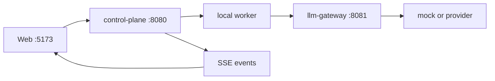

# neo-bot Web v1 architecture

neo-bot is the Web delivery repo. A browser talks to `/v1`. The control plane owns sessions and Runs. The worker runs the agent loop next to the workspace. The gateway is the only process that holds provider keys.

## Processes

| Process | Port | Role |
| --- | --- | --- |
| `packages/control-plane` | 8080 | Auth, Run state, SSE, artifacts, workspace orchestration |
| `packages/llm-gateway` | 8081 | Run JWT check, model alias, upstream or mock |
| `packages/worker` | spawned per Run | Local pi-agent loop and tools. Default `WORKER_RUNTIME=local` |
| `packages/web` | 5173 in `pnpm dev:web` | Chat UI. Proxies `/v1` and `/health` to :8080 |

`packages/contracts` and `packages/ui` are libraries. `packages/extensions` is worker-only.

## One Run

1. The user logs in at `POST /v1/auth/login`. Default local admin is `admin` / `123456`.
2. `POST /v1/runs` creates a Run. The control plane copies or clones `repoUrls` into `.neo/runs/<id>` and starts a local worker.
3. The worker asks the gateway for model tokens. The browser never sees a provider key.
4. The worker posts `RunEvent`s. The control plane fans them out on `GET /v1/runs/:id/events` as SSE.
5. The UI loads a transcript snapshot, then follows the live stream.
6. A follow-up is `POST /v1/runs/:id/follow-ups`. The same Run stays IDLE between turns.
7. Artifacts stay on `GET /v1/runs/:id/artifacts`. A mock pong Run may return an empty list.

## What this cut does not run

Desk, Mobile, admin, Java neo-loop, and Firecracker are not in this repo. See [v1-scope.md](./v1-scope.md).
