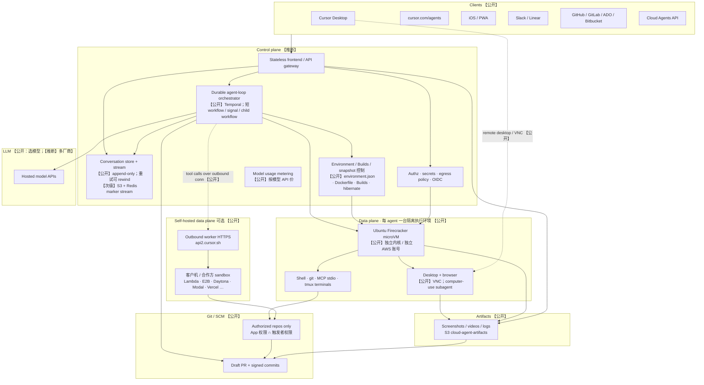

# Cursor Cloud Agent 公开架构调研

- **日期**：2026-09-11
- **读者**：Neo（对标 Cursor Cloud Agent 的产品）
- **仓库**：本调研写在 `neo-bot` / `Neo2Agent/neo-bot`，不写入 `neo-cloud-agent`
- **性质**：公开资料汇编 + 对标推断。**不是** Cursor 官方内部架构图，也不是实现规格。

## 结论先行

Cursor Cloud Agent（曾用名 Background Agent）的公开形态可以压成一句话：

> **控制面把 agent loop 做成可恢复的短 workflow；数据面给每个任务一台独立 Ubuntu microVM；对话状态单独存、单独流；产物以 draft PR + 截图/录像交回人类。**

对 Neo 最有用的不是复刻 Cursor 的每一块内部服务，而是先对齐这四条边界：

1. **隔离边界是 VM / microVM，不是共享内核 Docker。** Cursor 官方安全文档写明 runtime workspace 跑在 Firecracker-based microVM 上；每台 agent 一台独立环境。
2. **编排边界在 VM 外面。** Agent loop 住在 Temporal，不绑死在某台 VM 的 `while(true)`。机器可 hibernate、可换、可只读、可预热。
3. **会话边界与机器边界分离。** 对话可以跨 VM 回收继续；客户端看到的是 append-only 流，而不是「这台机器还活着」。
4. **交付边界是 draft PR + artifacts，不是自动合入。** Auto-run 终端命令必须以 egress allowlist、secret 脱敏、人工审 PR 兜底。

**落地顺序建议**：先买现成 sandbox（E2B / Vercel Sandbox / Daytona / Modal 等）+ Temporal + Git draft PR + noVNC；产品形态接近后再自建 Firecracker。不要把「共享内核容器当长期多租户边界」或「无 egress 的公网 auto-run」带进 MVP。

下文每条事实都标了来源置信度：

| 标记 | 含义 |
| --- | --- |
| **【公开】** | Cursor 官方文档或官方博客可核验 |
| **【次级来源】** | 第三方访谈、会议演讲、厂商对比文；可信但不是 Cursor 自己的产品规格 |
| **【推断】** | 由公开事实组合出来的架构解释，**非正式** |

---

## A. Cursor 公开事实

### A.1 命名：Background Agents → Cloud Agents

**【公开】** Cloud Agents 的前称是 Background Agents。官方文档在 Naming History 一节写明这一点。

产品定义也从「后台跑一下」扩成了「每任务一台云端开发机」：同一套 agent fundamentals，但不跑在用户笔记本上，而是跑在隔离 VM 里，带完整开发环境（clone 的仓库、依赖、secrets、启动命令、网络）。

- 来源：[Cloud Agents](https://cursor.com/docs/cloud-agent)

### A.2 每 agent 一台独立 Firecracker microVM（Ubuntu）；可并行、合上电脑继续跑

**【公开】** 官方 setup 写：「Cloud agents run on isolated Ubuntu machines。」安全文档进一步写：

- 每个 agent 有自己的 VM 边界，不是共享 process sandbox
- **Runtime workspaces run on Firecracker-based microVM infrastructure**
- Cloud Agent VM 放在与 Cursor 其它生产基础设施隔离的独立 AWS 账号里
- 一台 agent 看不到另一台的代码、环境或状态

能力侧：

- 想开多少并行就开多少；**不要求本机在线**
- 因为有独立 VM，agent 可以 build、测、点桌面/浏览器
- 支持 MCP；也支持 multi-repo（长跑 long-running 对 multi-repo 尚未开放）

**【次级来源】** Temporal Replay 2026 上，Cursor 工程师 Jeremy Stribling 用同一套产品叙事：用户启动后可合上电脑，过一小时或几天再回来；agent loop 发生在「专用 VM ↔ LLM」之间，不占用用户本机。

- 来源：[Cloud Agents](https://cursor.com/docs/cloud-agent)、[Security overview](https://cursor.com/docs/cloud-agent/security)、[Setup](https://cursor.com/docs/cloud-agent/setup)
- 次级：[Building agentic consumer products with Temporal at Cursor](https://temporal.io/resources/on-demand/building-agentic-consumer-products-with-temporal-at-cursor)

### A.3 Temporal 编排；agent loop / machine state / conversation state 三态解耦

**【公开】** Cursor 官方研究博文 *What we’ve learned building cloud agents*（Josh Ma，2026-06-02）是目前最完整的「控制面自白」：

1. **早期**用 work-stealing：worker 节点捡起 agent，loop 到结束。这是把本地 loop 搬到服务器，早期 beta 大约只有 **一个 9** 的可靠性。
2. 云端 VM 会碰到推理厂商抖动、pod 替换、EC2 宕机。团队发现自己快要把 Temporal 已有的 durable execution（重试、跨机调度、跨节点失败存活）重写一遍，于是迁过去。
3. 迁到 Temporal 后过了 **两个 9**。文中给出的量级（撰文时）：**每天超过 5000 万 Temporal actions**，覆盖 **700 万+ unique workflows**；内部超过 **40%** 的 PR 来自 cloud agents。
4. 架构原则：把 **agent loop、machine state、conversation state** 拆成解耦组件。
   - Loop 住在 Temporal，不在 VM 里 → 可以独立管 pod 生命周期，也能跑 **readonly VM / prewarmed VM**
   - 对话侧把存储和流式层从核心 workflow 拆出去：append-only 存储，向 web / desktop 推更新
   - 该层处理重试：某步 stream 出半截后失败再重试时，客户端能检测、rewind，再播新数据，而不是把旧半截和新半截拼在一起

**【次级来源】** Stribling 在 Temporal Replay 2026 把同一故事讲得更工程化：

- **Temporal 之前**：ECS runner 节点与 agent 绑定；进度偶尔写 S3；节点挂了再选新 leader。演讲者自己的评价是 “Temporal at home”，成功率大约 **90%**。
- **现在**：无状态 frontend → **Temporal Cloud** → 自建 worker（先 ECS，后因 deploy 可靠性改 **EKS + Temporal Kubernetes controller**）。
- Workflow 第一步检查「这台 agent 的专用 VM 是否还在、是否可达」；不可达就新建。然后才是 model ↔ tool call 的 loop。
- Follow-up 用 **Temporal signal**：已有 workflow 就插入下一轮；没有就新开一条 workflow，开头再决定要不要重建 VM。
- Subagent 是 **child workflow**：复用同一套 activities，但不重复「建 VM」；目标是干净上下文，避免污染父对话。
- 展示层最终**不再用 Temporal Query**（workflow 没在跑就要 replay，又慢又容易非确定性）。Frontend 读 **S3**，活跃时从 **Redis** 流；activity 往流里打 marker，客户端发现「时间倒退」就 rewind。

**【推断】** Temporal 管的是「这一轮任务如何可靠做完」，不是「这台 VM 永远挂着」。VM 供给、快照、预热池可以是另一条控制面（见 A.10 Anyrun）。两者不必是同一个进程。

- 来源：[What we’ve learned building cloud agents](https://cursor.com/blog/cloud-agent-lessons)
- 次级：[Temporal @ Cursor](https://temporal.io/resources/on-demand/building-agentic-consumer-products-with-temporal-at-cursor)

### A.4 短 workflow；hibernate / resume、snapshot、prewarmed / readonly VM

**【公开】** 同一篇 lessons 博文：

- 从 **eternal agent workflow** 改成 **多条短 workflow**：一条做完一件任务就退出，方便版本升级
- 把 activity 拆开，好表达「异步 tool call / subagent / 推理中断」的超时和重试
- 为「完整开发环境」重建了大量基础设施：hibernate / resume、checkpoint / restore / fork VM image、以及人机都能操作环境的 harness
- 因为 loop 不在 VM 上，才能用 **readonly VM** 和 **prewarmed VM** 做优化

**【公开】** Security / Builds 把「机器侧」说得更具体：

- 空闲后按生命周期 **hibernate，再删除** runtime
- **VM snapshot** 是盘的时间点拷贝（含 clone 过的代码），用来快速启动/恢复，不必重新 clone；滚动 **90 天不活动** 删除，每次 start/resume 续期
- **Conversation state** 默认长期保留，可用 Delete Agent API 删 transcript / artifacts
- Builds 会 **预热 active Build 的副本**，把 clone 和装依赖从「用户点开始」这条路径上拿掉
- Builds **只保留磁盘状态**；进程、shell 变量、内存缓存不会带进下一次 agent run。长驻服务放 `start` / `terminals`

**【次级来源】** Stribling：空闲就拆掉专用 VM；下次 prompt 再起一台，checkout 上次的分支、灌回对话，造成「agent 一直活着」的错觉。这也是短 workflow + 独立 conversation store 存在的产品理由。

- 来源：[lessons](https://cursor.com/blog/cloud-agent-lessons)、[Security](https://cursor.com/docs/cloud-agent/security)、[Builds](https://cursor.com/docs/cloud-agent/builds)
- 次级：[Temporal @ Cursor](https://temporal.io/resources/on-demand/building-agentic-consumer-products-with-temporal-at-cursor)

### A.5 Computer use：VNC 桌面；self-hosted 路径 TigerVNC + XFCE + xdotool + ffmpeg

**【公开】** 托管 Cloud Agent：

- 每台隔离 VM 带完整桌面；agent 可用鼠标键盘操作桌面和浏览器
- 用户可 **接管 remote desktop** 自己点，再交还 agent
- Harness 里有专门的 computer-use **subagent**（独立模型路由、prompt、录屏）；**VNC 和 Chrome 属于环境**，父 agent 和 subagent 共享。父 agent 也可以直接跑 Playwright
- Artifacts：截图、视频、日志引用；可嵌进 GitHub PR（走不可猜测的公开 URL，因为 GitHub 图片代理要 public URL）

**【公开】** Self-hosted Linux worker 的 computer use / desktop sharing 依赖官方点名的包：

```bash
sudo apt-get install -y --no-install-recommends \
  dbus-x11 ffmpeg tigervnc-standalone-server \
  x11-utils x11-xserver-utils xdotool xfce4
```

行为要点：

- `xdotool` / `ffmpeg` / X11 工具始终需要
- **TigerVNC + XFCE**：无头机上由 worker 自建托管桌面；`--share-desktop` 也要求 TigerVNC
- 显示解析顺序：`--display` → 继承的 `DISPLAY` → 自建 TigerVNC/Xfce
- Desktop sharing **只出站**，不开放入站端口；默认 `view_and_control`，剪贴板传输保持关闭
- macOS 走独立 helper app（Accessibility + Screen Recording），不是这套 X11 栈
- Dockerfile 环境的 computer use **只支持 Debian/Ubuntu 系**

**【次级来源】** Temporal 演讲现场演示：从 agent 页用 VNC 连进桌面，看 agent 点浏览器，或自己接管。

- 来源：[Capabilities](https://cursor.com/docs/cloud-agent/capabilities)、[Computer use and desktop sharing](https://cursor.com/docs/cloud-agent/bring-your-own-machine/computer-use)、[Agents can now control their own computers](https://cursor.com/blog/agent-computer-use)、[Setup · Computer Use Support for Dockerfile Repos](https://cursor.com/docs/cloud-agent/setup)
- 次级：[Temporal @ Cursor](https://temporal.io/resources/on-demand/building-agentic-consumer-products-with-temporal-at-cursor)

### A.6 Self-hosted：云端 loop + inference；客户机 outbound worker

**【公开】** Self-Hosted Machines 只搬家 **tool execution**，不搬家控制面：

| 仍在 Cursor 云 | 挪到客户机器 |
| --- | --- |
| Agent loop、inference、planning | 文件编辑、终端、computer-use、本地 MCP |
| 会话、transcript、（可选）artifacts 存储 | 完整 checkout、build cache、机器本地凭证 |

Worker 用 Cursor CLI：`agent worker start` 拉一条 **出站 HTTPS 长连接**。Cursor **从不打进**客户网络。需要放行：

- `api2.cursor.sh` / `api2direct.cursor.sh`（会话）
- `cloud-agent-artifacts.s3.us-east-1.amazonaws.com`（artifacts；可拦，只是 PR/dashboard 上看不到产物）

两种部署：

1. **My Machines**：个人机器，一机可多 agent
2. **Team Pools**（Enterprise）：按池认领，**一机一 agent**；controller 看队列 `spawn`；可 idle timeout、可 hibernate（快照停机，重连窗口内同 ID 恢复）

官方点名的合作/参考承载：AWS Lambda MicroVMs、Cloudflare、Namespace、Modal、Daytona、E2B、Vercel、Tensorlake、Coder，以及 `anysphere/k8s-workers`。这些是 **worker 跑在哪**，不是「Cursor 把 loop 也交给你」。

计费：模型按所选模型 API 价；托管路径含执行基础设施，self-hosted 还要自己付机器。

- 来源：[Self-Hosted Machines](https://cursor.com/docs/cloud-agent/self-hosted)、[Run cloud agents on machines you manage](https://cursor.com/blog/self-hosted-machines)

### A.7 生命周期：Provision → Run → Persist → draft PR → Hibernate → recycle

**【公开】** 安全文档把单次 run 写成六段。下表按官方顺序，并把「hibernate 再删」拆开，方便对标实现：

| 阶段 | 官方说法 | 工程含义 |
| --- | --- | --- |
| Start | 用户或集成从 Web / IDE / CLI / API / Slack / issue / PR 发起 | 控制面建会话，还不保证有 VM |
| **Provision** | 为该 agent 供给隔离 VM，clone 已授权仓库 | 冷启动、从 snapshot / Build / prewarm 池取机器 |
| **Run** | 在 VM 里跑代码和工具，stream 进度、输出、artifacts | Temporal loop：model ↔ tools ↔ VM |
| **Persist** | 对话、元数据、artifacts 写入 Cursor 管理存储，便于回顾和 resume | 与 VM 生命周期解耦 |
| **Hand off** | push 分支，开 **draft pull request**，合并前必须人类审 | 这是默认交付，不是 auto-merge |
| Hibernate / **Recycle** | 空闲后 hibernate runtime，再按 timer 删除 | snapshot 另按 90 天不活动回收 |

访问模型（对安全评审很重要）：

- 走 Cursor GitHub/GitLab App，不是某个人的 PAT
- **永不扩大权限**：agent 只能碰到触发者已经能碰到的仓库
- Cursor 员工不能进 Cloud Agent VM 里的代码
- 提交用 HSM 支持的 Ed25519 签名，GitHub/GitLab 显示 Verified

- 来源：[Security overview](https://cursor.com/docs/cloud-agent/security)

### A.8 环境 Builds / Dockerfile / `environment.json`

**【公开】** 「开发环境就是产品。」官方把不会配环境比成「不给工程师电脑」。配置入口：

1. Agent-led setup（推荐）：dashboard / Agents Window 里让 agent 装依赖、验证、出第一个 Build
2. 手写 Dockerfile + `.cursor/environment.json`
3. 解析顺序：仓库里的 `.cursor/environment.json` → 个人已存环境 → 团队已存环境

`environment.json` 典型字段：

```json
{
  "build": {
    "dockerfile": "Dockerfile",
    "context": ".."
  },
  "install": "pnpm install && ./custom_script.sh"
}
```

或 snapshot 基座：

```json
{
  "snapshot": "snapshot-20260212-00000000-0000-0000-0000-000000000000",
  "install": "npm install"
}
```

约束：

- **不要 `COPY` 整个项目**；Cursor 自己 checkout 正确 commit
- `dockerfile` / `context` 相对 `.cursor`；`install` 在仓库根执行
- `install`（曾叫 update script）必须幂等，在 **Build** 时跑，不阻塞每次 agent start
- `start` / `terminals`：agent 从 Build 起来后的长驻进程；`terminals` 在与人共享的 **tmux** 里

**Build** = 一份可启动的已准备环境快照：

1. Trigger（定时 / 改配置 / 手动 / agent 请求）
2. 从 base image 起，clone 环境内每个仓库的 default branch，跑完 `install`
3. Snapshot 磁盘，记下环境版本和各仓 SHA
4. 成功则 Activate
5. 新 agent / automation / code review 从 active Build 启动
6. 失败 **不替换** 当前 active Build

功能分支：先用 Build 的盘，再 checkout 用户指定分支。依赖变了，agent 可以再跑 install。

- 来源：[Setup](https://cursor.com/docs/cloud-agent/setup)、[Builds](https://cursor.com/docs/cloud-agent/builds)

### A.9 安全：egress / secrets；按模型 API 计价

**【公开】Egress**

- 默认有公网。三种模式：Allow all / Default + allowlist / Allowlist only
- Allowlist only 仍保留一小撮 Cursor 自身与 SCM 域名
- Enterprise 可锁定团队策略，个人不能改
- Auto-run 全部终端命令（与前台 agent「每条都要批准」不同）→ prompt injection 外泄是明确风险；官方指向 OpenAI 对 cloud agent 注入的说明
- 缓解：egress、Runtime Secret 脱敏、`.cursorignore`、**draft PR 人工审**、signed commits
- Artifacts 上传到 `cloud-agent-artifacts.s3.us-east-1.amazonaws.com`；allowlist 必须写精确 host，不要 `*.s3.us-east-1.amazonaws.com`
- 私网：Tailscale **userspace**、Cloudflare Tunnel、Enterprise 的 PrivateLink；不要把客户服务对公网开口

**【公开】Secrets**

| 类型 | 谁看得见 |
| --- | --- |
| Environment Variable | agent 可见；适合非敏感配置 |
| Runtime Secret（曾叫 Redacted Secret） | 仍是环境变量，但从 tool 结果、transcript、commit 打成 `[REDACTED]` |
| Build Secret | 只给 Docker build，不进运行中的 agent |

另有 OIDC：VM 本地 socket 签短时 JWT，换 AWS/GCP/Azure 角色，避免长期 AK。加密：在途 TLS 1.2+，静态 AES-256 **每 agent 一把钥匙**；Enterprise 可 CMEK/BYOK。Privacy Mode 下不拿 Cloud Agent 代码/对话训练。

**【公开】计价**

- Cloud Agents **按所选模型的 API 价**计费
- 可选更大 context window，会推高 token
- 首次使用要设 spend limit
- Builds **不另收费**
- Self-hosted：模型价照付，机器自付

- 来源：[Security](https://cursor.com/docs/cloud-agent/security)、[Secrets & Network](https://cursor.com/docs/cloud-agent/security-network)、[Cloud Agents · Billing](https://cursor.com/docs/cloud-agent)、[Builds](https://cursor.com/docs/cloud-agent/builds)、[Self-Hosted](https://cursor.com/docs/cloud-agent/self-hosted)

### A.10 次级来源：Anyrun + EC2 + Firecracker（Pragmatic Engineer）

**【次级来源】** Gergely Orosz / *The Pragmatic Engineer* 于 **2025-06-10** 访谈 Cursor 联合创始人 Sualeh Asif（Cursor 1.0、Background Agents 刚发布前后）：

- 编排服务名 **Anyrun**（Anysphere 的 pun），**纯 Rust**
- 职责：在云里拉起 agent，做安全与进程隔离
- 手段：**Amazon EC2 + AWS Firecracker**
- 更广的栈快照（同一篇，多半指 IDE/后端整体，不单指 Cloud Agent）：TypeScript + Rust 单体、AWS CPU + Azure 推理、Terraform、turbopuffer 等

**【推断 · 时间线】** 2025-06 的 Anyrun 描述，早于 2026 官方「迁到 Temporal、短 workflow、三态解耦」叙事。较稳妥的读法：

- Firecracker-on-EC2 作为 **数据面隔离** 被后来的安全文档坐实
- Anyrun 更像当时的 **VM/进程编排器**；2026 的 Temporal 接走了 **agent loop 的耐久执行**
- 两者是否仍同时存在、Anyrun 是否已改名/收窄，**公开材料没有说死**

同属次级、但与「买谁的 sandbox」直接相关：Fly.io 2026-09-09 的 agent sandbox 横评（E2B / Modal / Daytona / Vercel / Cloudflare / Sprites）。见第 C 节。

- 来源：[Real-world engineering challenges: building Cursor](https://newsletter.pragmaticengineer.com/p/cursor)
- 对照：[Security · Firecracker](https://cursor.com/docs/cloud-agent/security)、[Fly.io · Agent sandbox providers](https://fly.io/learn/agent-sandbox-providers/)

### A.11 其它公开能力（对标时不要漏）

这些不是「架构内核」，但是产品完整度清单：

| 能力 | 【公开】要点 | 来源 |
| --- | --- | --- |
| 入口 | iOS / Web `cursor.com/agents` / Desktop Cloud / Slack / GitHub·Bitbucket 评论 `@cursor` / Linear / API | [Cloud Agents](https://cursor.com/docs/cloud-agent) |
| MCP | HTTP（推荐，凭证不进 VM，backend 代理）与 stdio（跑在 VM 内）；OAuth 按用户 | [Capabilities](https://cursor.com/docs/cloud-agent/capabilities) |
| Cursor Cloud MCP | 当前 run、events、环境、transcript、Build 日志等诊断 | 同上 |
| Hooks | 仓库 `.cursor/hooks.json`；只读探索阶段不跑；没有本机 `~/.cursor/hooks.json` | [Cloud Agents](https://cursor.com/docs/cloud-agent) |
| Subscriptions | 等 GitHub / Slack / Linear / timer，最长 180 天；事件当 follow-up 唤醒 | [Capabilities](https://cursor.com/docs/cloud-agent/capabilities) |
| CI Autofix | 目前 GitHub Actions；自建 PR 自动修，有跳过条件 | 同上 |
| 分享 | 同团队 + 自己有该仓权限才能看；默认只读，admin 可开 team follow-ups | [Cloud Agents](https://cursor.com/docs/cloud-agent) |

---

## B. 推断架构图（非正式 / 非官方）

下面这张图是把第 A 节拼起来的 **对标用控制面/数据面草图**。框和箭头是【推断】；框里的产品名若来自官方文档则在旁注里标了【公开】。

**不要把这张图当成 Cursor 内部系统图。**



读图时抓住五条边：

1. **Clients → Control plane**：所有入口只打控制面，不直连别人的 VM。
2. **Orchestrator ↔ VM**：loop 在外，工具在内；VM 可换。
3. **Orchestrator ↔ LLM**：推理失败可按 activity 重试，不必重放整段对话。
4. **Orchestrator → Git**：clone/push 受「触发者已有权限」约束；交付是 draft PR。
5. **VM → Artifacts → Clients / PR**：验证证据和代码变更走两条路，用户不必 checkout。

Self-hosted 只替换图中 **Data plane** 方框，Control plane / LLM / 会话存储仍在云端。

---

## C. 基建选型表

Cursor 自己的托管路径是 **Firecracker microVM + 自建供给 + Temporal**。【推断】Neo 若自建同等隔离，长期会收敛到同一原语；MVP 不该一上来就运 Firecracker 集群。

下表对比「agent 代码跑在哪」。价格和限额会变，数字以各厂商文档为准；Fly.io 横评核对日为 **2026-09-10**。

| 选项 | 隔离原语 | 空闲后还剩什么 | 适合 Neo 的阶段 | 主要代价 | 来源 |
| --- | --- | --- | --- | --- | --- |
| **Firecracker 自建**（Cursor 托管同款原语） | 每租户独立内核 microVM | 你自己做 snapshot / hibernate / 预热池 | 接近 Cursor 之后 | 要自己做供给、镜像、网络策略、热池、值班 | 【公开】[Security](https://cursor.com/docs/cloud-agent/security)；【次级】[Pragmatic Engineer](https://newsletter.pragmaticengineer.com/p/cursor) |
| **E2B** | Firecracker microVM | 默认超时杀掉；**pause** 可无限期保留盘+内存 | **MVP 首选之一**（有 Desktop/VNC） | Hobby 连续跑 1h / Pro 24h，pause 可重置 | 【次级】[Fly.io 对比](https://fly.io/learn/agent-sandbox-providers/)；Cursor 官方 self-hosted 合作方 |
| **Vercel Sandbox** | Firecracker microVM | stop 时自动 snapshot 文件系统 | MVP（已在 Vercel 体系时） | Hobby 会话 45min / Pro 24h；进程不随 snapshot 活 | 同上 |
| **Daytona** | 默认容器；可上独立内核 VM 档 | 文件系统保留；停 7 天后归档 | MVP / 中期（要 GPU 或强持久盘） | 默认配置偏小；要自己选 VM class 才有真内核隔离 | 同上 |
| **Modal Sandboxes** | gVisor（用户态内核） | 不 snapshot 就没了；内存快照 7 天过期 | MVP（已有 Modal 流水线 / 要 GPU） | 默认寿命 5min，最长 24h；隔离弱于硬件 VM | 同上 |
| **Fly Sprites** | Firecracker microVM | 100GB 盘不过期；约 30s 暂停，暖醒保进程 | MVP / 中期（要「这台电脑还在」） | 无 GPU；egress 策略从 API 设，沙箱内只读 | 同上 |
| **Lambda MicroVMs** | Firecracker；快照起、闲挂起 | 会话结束即清；官方写最长约 8h | Self-hosted worker / 企业 AWS 账号 | 无集群，但要按 Cursor 的 pool controller 接 | 【公开】Cursor self-hosted 合作；[AWS 文档](https://docs.aws.amazon.com/lambda/latest/dg/microvms-integrations-cursor-self-hosted-machines.html) |
| **Cloudflare Sandbox** | 容器，实例在独立 VM 里 | 容器停则文件和进程都没 | 短工具调用，不适合多轮写代码 | 状态必须外置 | 【次级】Fly.io |
| **Docker + K8s**（共享内核） | 默认 runc，内核与宿主机共享 | 看你是否自己做 PVC / 快照 | 内部狗粮、**单租户** worker | **不能当长期多租户安全边界**；Cursor 自己的 k8s-workers 是 self-hosted 模板，不是托管隔离模型 | 【公开】[Self-hosted Integrations](https://cursor.com/docs/cloud-agent/self-hosted)；【推断】威胁模型 |

选型时只问四件事（Fly.io 的框架，和 Cursor 安全文档一致）：

1. **隔离**：硬件 VM / 用户态内核 / 共享内核？
2. **状态**：agent 下线 10 分钟，工作树还在吗？
3. **Egress**：默认开公网，还是能 deny-all + allowlist？
4. **计时器**：会话上限会不会在一次 CI 修不好之前把沙箱掐死？

Computer use：E2B 有现成 Ubuntu + XFCE + VNC Desktop sandbox；其它家多半要自己装 Chrome/TigerVNC。这和 Cursor self-hosted Linux 清单同构。

---

## D. 给 Neo 的落地路线

目标不是「第一天长得像 Cursor 官网」，而是 **第一天就不要选错边界**。

### D.1 MVP：买 sandbox + Temporal + Git draft PR + noVNC

最小可对标切片（一条用户可感知的闭环）：

```text
用户从 Web/API 丢任务
  → 控制面开一条短 Temporal workflow
  → 向 E2B / Vercel / Daytona / Modal / Sprite 要一台隔离机
  → clone 到功能分支，跑 install/测试
  → 对话写入独立 store，并向客户端 stream
  → 开 draft PR；截图/短视频经 noVNC 或厂商 Desktop API 留下
  → workflow 结束；沙箱 pause/snapshot，而不是进程挂着睡
```

MVP 必须有、但可以很薄的部分：

| 模块 | 最小做法 | 刻意不做 |
| --- | --- | --- |
| 编排 | Temporal（或等价 durable execution）一条「单任务」workflow | VM 内 `while(true)` 当控制面 |
| 执行 | 托管 Firecracker/gVisor sandbox，一任务一沙箱 | 多租户共一个 Docker 主机网络 |
| Git | App 或安装级 token；权限 = 触发者 ∩ 授权仓；**只开 draft PR** | auto-merge、用个人 PAT 扫全 org |
| 桌面 | 厂商 Desktop 或 noVNC + 预装 Chrome | 一上来做 macOS helper / 剪贴板同步 |
| 安全 | 默认 **allowlist egress**；secret 不进 transcript | 公网全开 + auto-run |
| 计费 | 按模型 token 记账 + sandbox 秒计 | 先做复杂套餐 |

**【推断】** 这已经覆盖 Cursor 对外承诺的骨架：并行、离开电脑、独立环境、可验证产物、人审 PR。缺的是自建热池、readonly VM、企业级 CMEK、self-hosted pool controller——那些不决定产品是否成立。

### D.2 接近 Cursor：补「环境即产品」和三态解耦

第二阶段才配得上「对标」：

1. **environment.json 等价物**：`install`（Build 时，幂等）/ `start` / `terminals`（tmux）分开
2. **Builds**：后台 clone+install+snapshot；失败不覆盖上次成功；agent 记录用了哪次 Build
3. **三态拆开**：
   - loop = Temporal 短 workflow + signal follow-up + child subagent
   - machine = 可 hibernate 的 sandbox ID / snapshot ID
   - conversation = append-only + 可 rewind 的流
4. **Computer-use subagent**：独立 prompt/模型；桌面属于环境，父 agent 也能 Playwright
5. **策略**：Runtime Secret 脱敏、OIDC 短票、signed commits、team egress lock
6. **订阅/CI**：PR 评论和 CI 失败当 follow-up 唤醒，而不是轮询打满 VM

此时仍建议 **继续买 sandbox**。Cursor 自己都把 self-hosted 接去 E2B/Daytona/Modal/Lambda，说明「loop 自建、机器可租」是合法架构，不是偷懒。

### D.3 自建 Firecracker：只在下面成立时再做

同时满足再开工：

- 托管 sandbox 的隔离、休眠、egress 或数据驻留谈不拢
- 已有人能 oncall 一套 microVM 集群（镜像构建、veth/CNI、snapshot 仓库、预热池、宿主机 CVE）
- 产品已经依赖「秒级从热镜像起、按盘 fork、只读试跑」这类自建才划算的能力

自建范围建议只含 **数据面**：Firecracker + jailer + snapshot + egress proxy。控制面继续 Temporal。不要把 Anyrun 级编排器和 Temporal 再熔成一个单体。

### D.4 明确不要做

| 不要 | 为什么（对照 Cursor 公开教训） |
| --- | --- |
| **用共享内核 Docker 当长期多租户边界** | Cursor 安全文档把隔离定义在 **每 agent 一台 VM / Firecracker**。runc 容器共用宿主机内核，agent 又是任意代码 + auto-run，攻击面比「工程师笔记本上的 devcontainer」大一个数量级。Docker/K8s 只适合 **单租户 self-hosted worker** 或内部狗粮。 |
| **把 loop 绑死在单 VM `while(true)`** | 官方从 eternal workflow 退回短 workflow；机器要能 hibernate、只读、预热、被换掉。Loop 在 VM 里 = 推理抖动和换机都会整段重来，早期大约一个 9。 |
| **无 egress 约束的公网 auto-run** | 官方承认 auto-run + 注入 = 外泄。默认应是 Default+allowlist 或 Allowlist only；artifacts 桶名写死；禁止 `*.s3.amazonaws.com` 这种宽通配。没有这条，draft PR 也救不回已经打出去的包。 |

另外三条次要红线（【推断】，但是同一威胁模型）：

- 用「触发者没有的仓库权限」跑 agent
- secret 明文进模型上下文 / commit
- 把 conversation 存在 VM 磁盘上当唯一真相（机器一回收，会话就没了，也无法 rewind）

---

## E. 来源与阅读顺序

### 官方（建议按这个顺序读）

1. [Cloud Agents](https://cursor.com/docs/cloud-agent) — 产品定义、并行、计费、Background → Cloud 更名
2. [What we’ve learned building cloud agents](https://cursor.com/blog/cloud-agent-lessons) — Temporal、三态、短 workflow、hibernate、readonly/prewarm
3. [Security overview](https://cursor.com/docs/cloud-agent/security) — Firecracker、生命周期、加密、draft PR
4. [Secrets & Network](https://cursor.com/docs/cloud-agent/security-network) — secret 类型、egress 三模式
5. [Setup](https://cursor.com/docs/cloud-agent/setup) — Ubuntu、`environment.json`、Dockerfile
6. [Builds](https://cursor.com/docs/cloud-agent/builds) — 预热快照、install vs start
7. [Capabilities](https://cursor.com/docs/cloud-agent/capabilities) — computer use、artifacts、MCP、订阅
8. [Self-Hosted Machines](https://cursor.com/docs/cloud-agent/self-hosted) — 云端 loop，出站 worker
9. [Computer use on your machine](https://cursor.com/docs/cloud-agent/bring-your-own-machine/computer-use) — TigerVNC + XFCE + xdotool + ffmpeg
10. [Agent computer use](https://cursor.com/blog/agent-computer-use) — 桌面/录像产品叙事
11. [Self-hosted machines blog](https://cursor.com/blog/self-hosted-machines) — 合作 sandbox 与 pool hibernate

### 次级

12. [Pragmatic Engineer · building Cursor](https://newsletter.pragmaticengineer.com/p/cursor) — Anyrun、EC2、Firecracker（2025-06）
13. [Temporal · Cursor Replay talk](https://temporal.io/resources/on-demand/building-agentic-consumer-products-with-temporal-at-cursor) — 短 workflow、signal、S3/Redis 流、ECS→EKS
14. [Fly.io · agent sandbox providers](https://fly.io/learn/agent-sandbox-providers/) — E2B / Modal / Daytona / Vercel / Sprites / Cloudflare（2026-09-10 核对）

### 本文没有声称的事

- 没有 Cursor 内部服务真实名称、队列拓扑、代码路径（除公开出现过的 Temporal / Anyrun / Firecracker）
- 没有性能数字的独立实测；文中 QPS、PR 占比、actions/day 全部引自上述公开/次级来源，时点不同，不要横比成同一天的指标
- 没有实现 Neo 控制面或数据面的代码；本文只做对标输入

---

## 修订

| 日期 | 说明 |
| --- | --- |
| 2026-09-11 | 初稿。仅依据上列公开 URL 与次级来源，供 Neo 对标。 |
